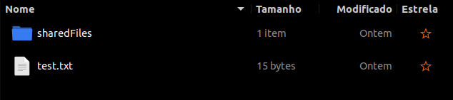

# SIRS_RRRD
SIRS course project 2020-2021

## Run locally (clients, server and backup in same machine)

### Pre-requisites:
 - Linux (Ubuntu 20.04, openSuse)
 - Java 11
 - Maven
 - Keytool

### Build locally
```
./genca.sh
./genclient.sh keys
mvn compile
```
<b>NOTE</b>: If you want to simulate more than one client, run `./genclient.sh <keysRootFolder>` as many times as clients you want, and specifying different `<keysRootFolder>`s.

`genca.sh`             |  `genclient.sh`
:-------------------------:|:-------------------------:
  |  

### Exec:
#### Server:
  - Make sure there is a `files` folder inside the main folder
  - Make sure there is a `tmp` folder inside the main folder
  - run `mvn exec:java`
  


#### Backup:
  - Make sure there is a `files` folder inside the main folder
  - Make sure there is a `tmp` folder inside the main folder
  - run `mvn exec:java`
  
  
  
#### Client:
  - For each client, make sure there exists a `<fileRootFolder>` and a `<keysRootFolder>` inside the main folder. Also `<fileRootFolder>` must have a `sharedFiles` folder inside it
  - Make sure there is a `tmp` folder inside the main folder
  - run `mvn exec:java -Dexec.args="-f <fileRootFolder> -k <keysRootFolder>"` 
  
  
  
  
## Run in VMs (each client, server and backup in different VMs)

### Pre-requisites:
One machine per node with
 - Ubuntu 18.04 64 bit
 - Java 11
 - Maven
 - Keytool

### Connections:
 - Make sure the VMs have a NAT adapter to connect to general internet
 - One other adapter for an internal network (`sw-1` for example)
 - setup IP of each node, all must be in network `192.168.0.0/24`
      - Server must have IP `192.168.0.100`
      - Backup must have IP `192.168.0.200`
 

### Build: <!-- maybe discriminate by node-->
Make sure to run the scripts described in [Build Locally](#build-locally) beforehand in the folder with **ALL** the modules (Client, Server, Backup).
If you want to have more than one client, also run `genclient.sh <keysRootFolder>` as many times as wanted.
After that you can copy each module to the wanted VM. 

**NOTE 1:** Always copy the CA folder alongside with wanted module, as this has the CA files that all nodes will need.

**NOTE 2:** In client machines, delete all but one of the created `<keysRootFolder>` and change the folder name do `keys`. This will simulate a client that only knows its keys.

**NOTE 3:** If you have copied just the module (with CA folder, as in NOTE 1), you can delete the `pom.xml` file and rename the `pom_VM.xml` file to `pom.xml`.

In each machine run:
```
mvn compile
```

### Exec:
#### Server VM:
  - run `mvn exec:java`
  
#### Backup VM:
  - run `mvn exec:java`
  
#### Client VM:
  - run `mvn exec:java` 

## Serialization
Server and Backup will always pick up from the point when they were shutdown, by loading the `tmp/<backup|server>.ser` file (if it exists) and will always save their current state to the same `.ser` file when being shutdown (through `Ctrl^C`). 

## Commands

When starting the client, you will be prompted to say in which file to load a previously saved client. If it is the first time you are executing the client or don't want to load a store one, just press `Enter` without inputing a filename.

 

### Login/Register
In order to start using the system you must first register. Type `register` next to the `>` prompt and follow the procedure. If at any time you need to login, just type `login` and write your username and password.


### Create a file
To upload a file to the system, make sure it exists inside the `<fileRootFolder>`. Then type `create file` after the prompt and type the path to the file (starting in the `<filesRootFolder>`). You can't create a file inside the `sharedFiles` folder.




### Edit a file
To tell the system you edited an existing file, type `edit file` after the prompt and type the path to the file (also starting in the `<filesRootFolder>`).

### Share a file
To share a file with an existent user, type `share file` after the prompt, type the path to the file, like in the commands above, and then type the user to which you want to share. You can't share a file inside the `sharedFiles` folder.


### Get shared
To download files that where shared with you, type `get shared` after the prompt. The shared files will appear in a folder with the files' owner name inside the `sharedFiles` folder.


### Get file
To get the newest version of a file stored in the Server that you also have locally, type `get file` after the prompt and then type the file path (also starting in the `<filesRootFolder>`).


### Revoke authorization
To revoke the authorization of a user to edit a file, type `revoke file` after the prompt. Type the file path (also starting in the `<filesRootFolder>`), and then the user to which you want to revoke the authorization. You can't revoke from a file not created by you, that is, not inside the `sharedFiles` folder.


### Exit
To stop your connection to the Server type `exit` after the prompt. You will be prompted to say in which file to store this client. If you don't want to save the current state of this client, just press `Enter` without specifying a file.


## Ransomware
To simulate a ransomware attack, go to the Server process (in VM or locally) and change one of the stored files (by deleting or adding characters). Then do a `get file` in one of the clients for the specified file. You will see the file will be recovered from the backup and the client will have the newest correct version of the file.
